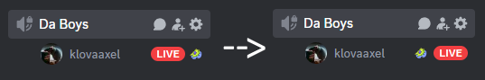

# Swap live and status icons

A BetterDiscord theme that simply swaps the location of the live and status icons

Discord recently made this change where they force a status on you when you join a voice channel. This plugin simply swaps the location of the live and status icons so that you can hover from the live icon to the stream preview and watch now button. (it makes it hard to change the status but I don't really care about that)

Discord plz fix.

## Bonus

also includes an optional RemoveStatus.theme.css file that removes the status icon entirely for those who really don't care about it
